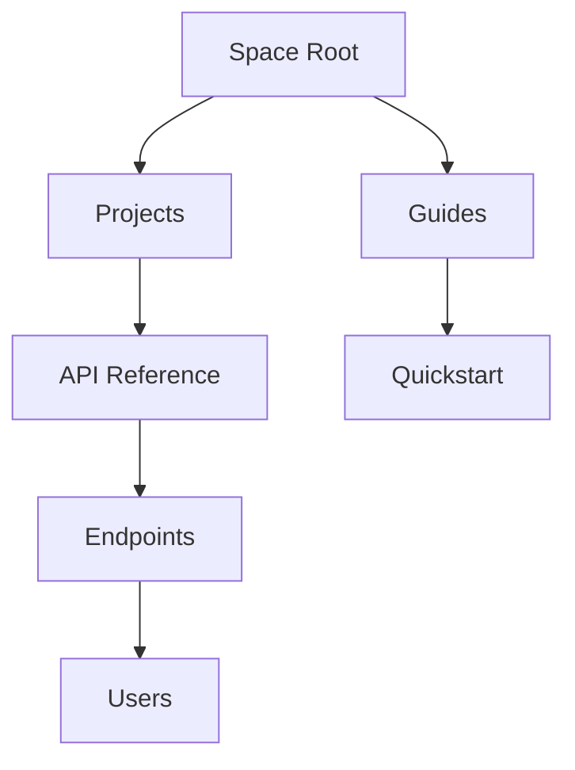

## Overview

Lunda organizes your documentation around core building blocks: spaces, projects, documents, and collaboration tools. You use spaces to group related documentation, projects to manage specific initiatives, and hierarchical documents to structure content logically. These concepts enable scalable workflows for teams building technical docs, APIs, or product guides.

<Callout kind="info">
  Master these concepts to streamline your documentation process and collaborate efficiently.
</Callout>

## Key Concepts

<Columns cols={2}>
  <Card title="Spaces" icon="database" href="#documentation-spaces">
    Central hubs for organizing docs across teams and products.
  </Card>
  <Card title="Projects" icon="folder" href="#projects">
    Focused workspaces within spaces for versioned documentation.
  </Card>
  <Card title="Documents" icon="file-text" href="#document-types">
    Hierarchical pages with MDX support for rich content.
  </Card>
  <Card title="Collaboration" icon="users" href="#collaboration">
    Real-time editing, reviews, and permissions.
  </Card>
</Columns>

## Documentation Spaces

You create a space in Lunda to serve as a top-level container for all your documentation. Each space supports unlimited projects and enforces permissions at the space level.

<Steps>
  <Step title="Create a Space" icon="plus">
    Navigate to the Spaces dashboard and click `New Space`. Enter a name like `Lunda API Docs` and select your brand color `{brandColor: "#3B82F6"}`.
  </Step>
  <Step title="Configure Settings" icon="settings">
    Set visibility to `public` or `private`, and invite team members via email.
  </Step>
  <Step title="Add Projects" icon="folder-plus">
    Link projects to organize content within the space.
  </Step>
</Steps>

Spaces integrate with your GitHub repo for version control, syncing changes automatically.

## Projects

Projects live inside spaces and represent self-contained documentation sets, such as user guides or API references. You version projects independently, enabling release-specific docs.

<Tabs>
  <Tab title="API Project" icon="code">
    Ideal for endpoint references with `ParamField` and `Request` components.

    ```yaml
    project:
      name: "API Reference"
      version: "v1.2.0"
      endpoints:
        - path: "/users"
          method: "GET"
    ```
  </Tab>
  <Tab title="User Guide" icon="book-open">
    Suited for tutorials with `Steps` and `CodeGroup`.

    ```yaml
    project:
      name: "Quickstart Guide"
      audience: "developers"
      sections:
        - "Installation"
        - "Configuration"
    ```
  </Tab>
</Tabs>

## Document Types and Hierarchies

Lunda supports nested documents forming a tree structure. Root documents appear in the sidebar, with children indented below.



| Type       | Description                          | Use Case                  |
|------------|--------------------------------------|---------------------------|
| Page       | Standard MDX page                    | Concepts, guides          |
| Index      | Landing page with cards/columns     | Project overviews         |
| Changelog  | Version history with `Update`        | Release notes             |

Use hierarchies to mirror your product's structure, improving navigation.

<CodeGroup tabs="JavaScript,Python">
  ```javascript
  // Fetch space hierarchy
  const response = await fetch('https://api.example.com/spaces/{spaceId}/hierarchy');
  const docs = await response.json();
  console.log(docs.tree);
  ```
  ```python
  import requests
  response = requests.get('https://api.example.com/spaces/{spaceId}/hierarchy')
  docs = response.json()
  print(docs['tree'])
  ```
</CodeGroup>

## Collaboration Fundamentals

You collaborate in real-time with inline comments, @mentions, and role-based permissions. Assign reviewers to projects and track changes via history.

<Expandable title="Advanced Permissions" default-open="false">
  Define roles like `editor`, `viewer`, and `admin`. Use space-level settings for broad access and project-level for granular control.

  ```javascript
  const permissions = {
    space: { role: 'admin' },
    project: { role: 'editor' },
    doc: { readOnly: true }
  };
  ```
</Expandable>

<Callout kind="tip">
  Enable notifications for @mentions to stay in sync with team changes.
</Callout>

These concepts form the foundation for effective Lunda workflows. Start by creating your first space to experiment.