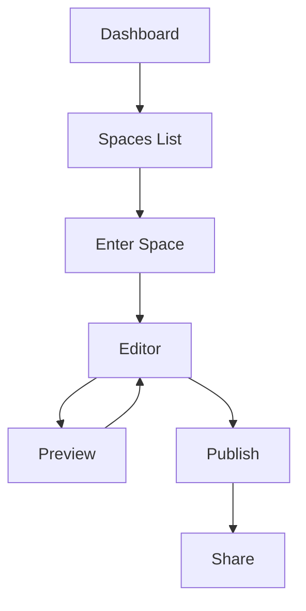

## Prerequisites

<Callout kind="info">
Before starting, ensure you have:
- A modern web browser (Chrome, Firefox, or Safari)
- An email address for account verification
- Optional: Existing project docs in Markdown or GitHub repo
</Callout>

## Create a Lunda Account

Sign up for Lunda in under a minute to access your documentation dashboard.

<Steps>
  <Step title="Visit Lunda" icon="globe">
    Navigate to [https://app.lunda.com](https://app.lunda.com) and click **Sign Up**.
  </Step>

  <Step title="Enter Details" icon="user">
    Provide your email, create a password, and complete the verification.
  </Step>

  <Step title="Verify Email" icon="mail">
    Check your inbox for the verification link and click it to activate your account.
  </Step>
</Steps>

## Set Up Your First Documentation Space

Organize your project docs by creating a dedicated space.

<Steps>
  <Step title="Create Space" icon="folder-plus">
    From the dashboard, click **New Space** and name it (e.g., "My Project Docs").
  </Step>

  <Step title="Configure Basics" icon="settings">
    Set the space visibility (public, private, or team) and add a description.
  </Step>

  <Step title="Save and Enter" icon="check-circle">
    Save the space. You'll land in the editor interface ready for content.
  </Step>
</Steps>

## Import Initial Project Documentation

Bring in your existing docs quickly using these methods.

<Tabs>
  <Tab title="Manual Upload" icon="upload">
    Drag and drop Markdown files (.md, .mdx) directly into your space root.
    
    <Image
      src="https://via.placeholder.com/800x400/3B82F6/white?text=Upload+Files"
      alt="Manual file upload interface in Lunda"
      width="800"
      height="400"
    />
  </Tab>

  <Tab title="GitHub Repo" icon="github">
    Connect your GitHub account via **Integrations > GitHub**.
    
    1. Authorize Lunda.
    2. Select your repo (e.g., `your-org/project-docs`).
    3. Import branches and files automatically.
  </Tab>

  <Tab title="API Import" icon="code">
    Use the Lunda API to programmatically import content.
    
    <CodeGroup tabs="JavaScript,cURL">
      ```javascript
      const response = await fetch('https://api.lunda.com/v1/spaces/{SPACE_ID}/import', {
        method: 'POST',
        headers: {
          'Authorization': 'Bearer YOUR_API_KEY',
          'Content-Type': 'application/json'
        },
        body: JSON.stringify({
          source: 'markdown',
          content: '# Welcome to My Docs\n\nYour project overview here.'
        })
      });
      ```
      ```bash
      curl -X POST https://api.lunda.com/v1/spaces/{SPACE_ID}/import \
        -H "Authorization: Bearer YOUR_API_KEY" \
        -H "Content-Type: application/json" \
        -d '{
          "source": "markdown",
          "content": "# Welcome to My Docs\n\nYour project overview here."
        }'
      ```
    </CodeGroup>
  </Tab>
</Tabs>

<Callout kind="tip">
Replace `{SPACE_ID}` with your actual space ID from the dashboard URL and `YOUR_API_KEY` from [https://app.lunda.com/settings/api](https://app.lunda.com/settings/api).
</Callout>

## Basic Navigation and Editing

Master the editor basics to start customizing.



- **Navigation**: Use the left sidebar for pages, search bar for quick finds.
- **Editing**: Markdown/MDX support with live preview. Add images via drag-drop.
- **Publish**: Click **Publish** to make changes live.

<Expandable title="Advanced Editing Shortcuts" default-open="false">
- `<kbd>Ctrl</kbd>+<kbd>S</kbd>`: Save draft
- `<kbd>Ctrl</kbd>+<kbd>P</kbd>`: Toggle preview
- Use `{variable}` syntax in backticks for code-like elements.
</Expandable>

## Next Steps

<Columns cols={3}>
  <Card title="Authentication" icon="lock" href="/authentication">
    Secure your spaces with API keys and teams.
  </Card>

  <Card title="Advanced Guides" icon="book-open" href="/introduction">
    Dive deeper into features and customization.
  </Card>

  <Card title="Changelog" icon="git-branch" href="/changelog">
    Stay updated with latest releases.
  </Card>
</Columns>

<Callout kind="success">
Congratulations! You've set up Lunda. Explore your space and build out your docs.
</Callout>